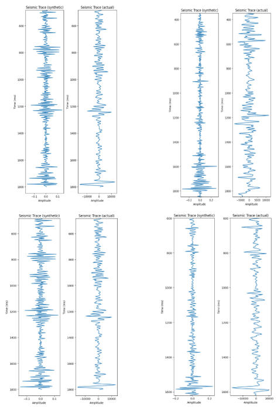
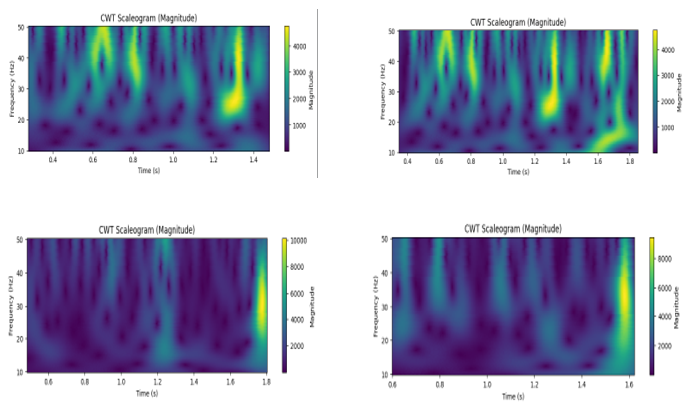
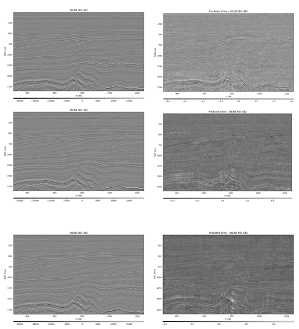

# CWT + DNN Based Seismic Resolution Enhancement - F3 Dataset

**BTP Project | IIT Kharagpur | 2025–26**  
Fazal Rab Abdali (22EX5PE02) | Abdin Shaikh (22EX5PE03)  
Supervisor: Prof. P. N. S. Roy

---

## What We Did
Trained a fully connected DNN to map CWT features of real band-limited seismic traces to high-frequency synthetic seismic amplitudes derived from well logs - effectively enhancing seismic resolution without additional acquisition.

**Input:** CWT (real + imaginary + magnitude) of real seismic → 300-D feature vector  
**Target:** Synthetic seismic from well logs (Ricker wavelet 70 Hz convolved with reflectivity)  
**Model:** DNN 300 → 150 → 75 → 1 | Adam | MSE | 500 epochs

---

## Results

### Synthetic vs. Actual Seismic Trace (Well-to-Seismic Tie)
<!-- INSERT: FinalWork.ipynb → "Seismic Trace (synthetic)" vs "Seismic Trace (actual)" side-by-side for all 4 wells -->


### CWT Scalograms — All 4 Wells (Model Input Features)
<!-- INSERT: FinalWork.ipynb → CWT Scaleogram (Magnitude) plots for F02-1, F03-2, F03-4, F06-1 -->


### ⭐ Predicted Enhanced 2D Seismic Section — Inline 442
<!-- INSERT: FinalWork.ipynb → original inline imshow vs DNN predicted section -->


---

## Dataset
F3 Demo - Netherlands North Sea  
https://opendtect.org/osr/pmwiki.php/Main/NetherlandsOffshoreF3BlockComplete4GB

## Dependencies
```bash
pip install segyio lasio PyWavelets numpy scipy matplotlib pandas tensorflow scikit-learn
```

## Report
See `BTP_Report_Final.pdf` for full methodology and results.
